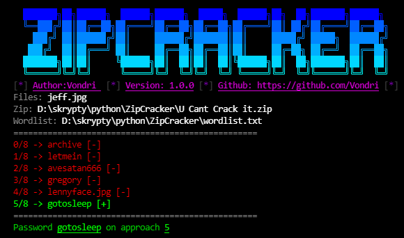

<div align="center">
  
  <h3>
    🔥🔓 ZipCracker 🔓🔥<br>
    ✔ v1.0.0 ✔<br>
    Created by <a href="https://gtihub.com/vondri">Vondri</a>
  </h3>
</div>

<div align="center">
  
  
  
  
  
</div>

* * * * * * * * *
<div align="center">
  <h3>The script was written to crack passwords to zip files</h3>
</div>

## Features
- [x] 📝Script work with params e.g `-h`📝
- [x] Silently launching (without baner)

## Requirements
  * 

## Usage
* #### Linux
    ```
    git clone https://github.com/Vondri/zipcracker.git
    cd zipcracker
    chmod +x ZipCracker.py
    python ZipCracker.py -z '.\U Cant Crack it.zip' -w wordlist.txt
    ```
* #### Windows
Download, extract zip and run script by `python ZipCracker.py -z '.\U Cant Crack it.zip' -w wordlist.txt`
